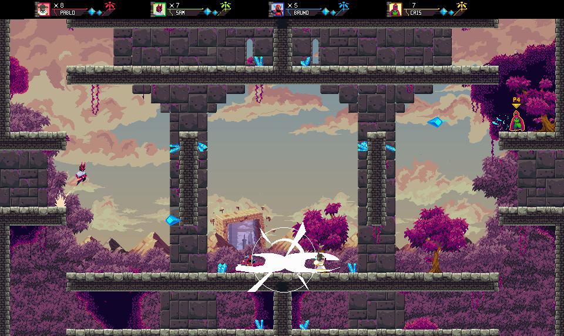
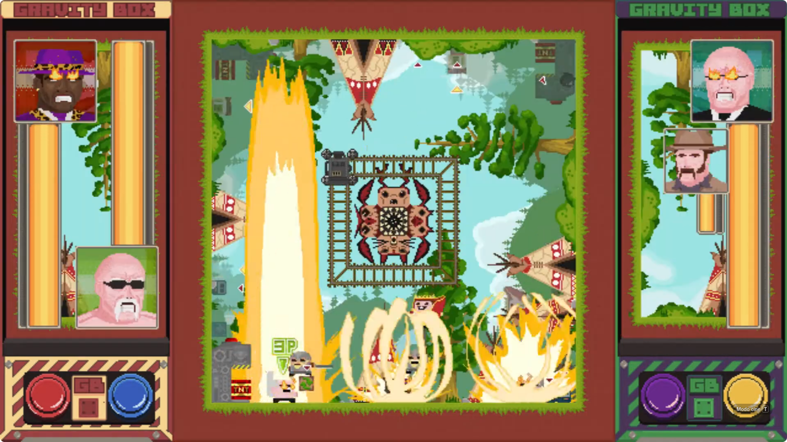
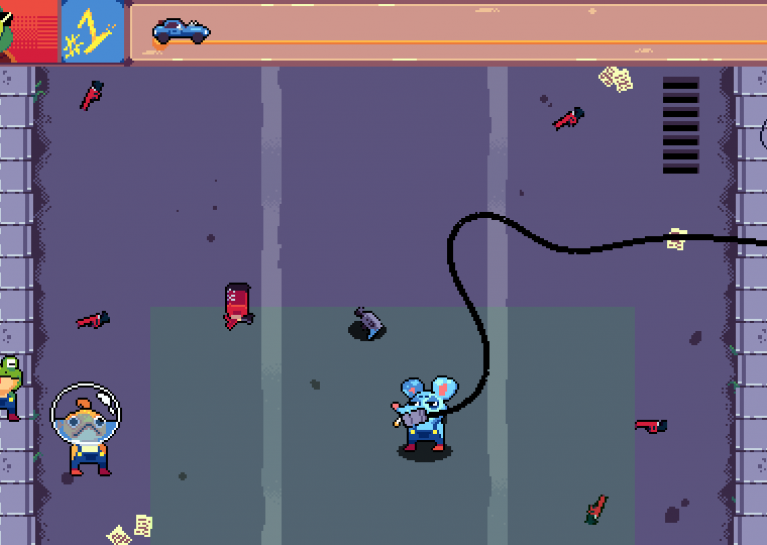
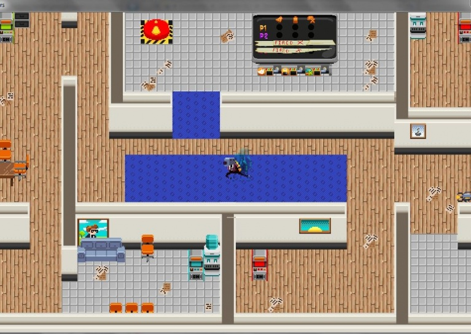
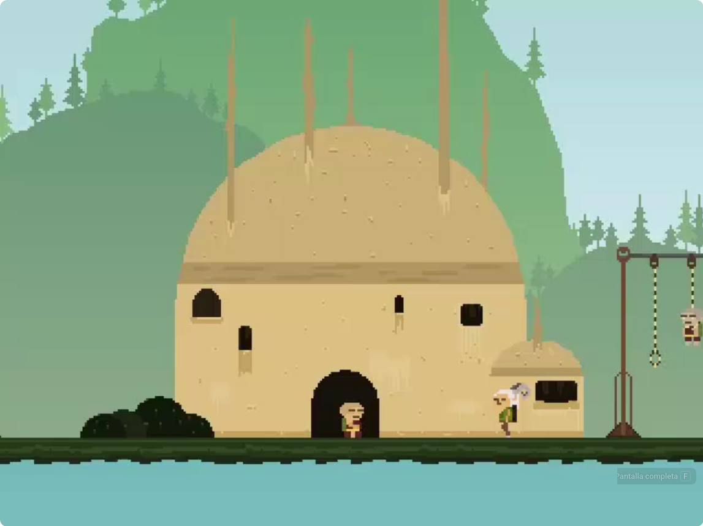

[Indice](README.md) · **Games** · [Artículos](PAPERS.md) · [Trabajos](JOBS.md) · [Otros](OTHER.md)

# 🎮 Largo Desarrollo

## [Libelula]()

## [Gravity Box](https://axolotlbros.itch.io/sacrifice-your-brothers)

# 🎮 Publicados

## [Sacrifice your Brothers 2018](https://axolotlbros.itch.io/sacrifice-your-brothers)

## [Me Canso Ganso 2019](https://apkpure.com/de/me-canso-ganso/com.piratagamesparatu.mecansoganso/download/1.0.0)

## [Sweet Valentine's Day 2014](https://apkpure.com/sweet-valentine-s-day-free/com.axolotl.svdayfree)

## [Morbus 2012](https://drive.google.com/file/d/1DNkXIkSf1YP37GFBk0NhI1SNT005FhZE/view?usp=sharing)

# 🕹️ Game Jams

## [Comrade Spatial Baby - GGJ 2024](https://globalgamejam.org/games/2024/comrade-spatial-baby-9)

## [Pit's Fire - GGJ 2020](https://v3.globalgamejam.org/2020/games/pits-fire-4)

## [La Casa del Roboritmo - GGJ 2019](https://v3.globalgamejam.org/2019/games/la-casa-del-roboritmo)

## [Chromobot Fighters: Roboffice Edition - GGJ 2017](https://v3.globalgamejam.org/2018/games/chromobot-fighters-roboffice-edition)

## [Devil's Best Friend - GGJ 2016](https://v3.globalgamejam.org/2016/games/devils-best-friend)

## [Sweet Valentine's Day — GGJ 2013](http://2013.globalgamejam.org/2013/sweet-valentines-day)

## [A flight of the Swallow - GGJ 2012](https://globalgamejam.org/2012/flight-swallow)

