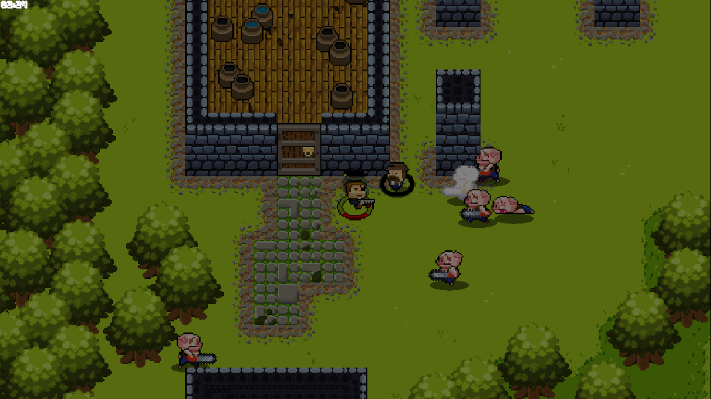
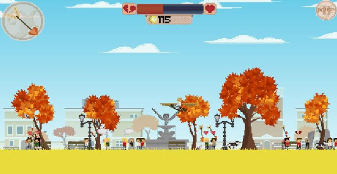
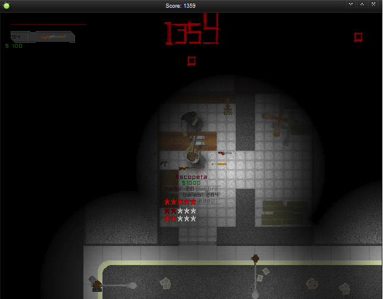
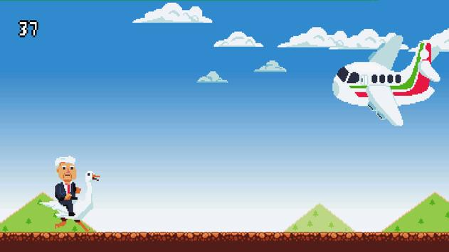

[Home](README.md) · **Games** · [Papers](PAPERS.md) · [Trabajos](JOBS.md) · [Other](OTHER.md)

# 🎮 Juegos independientes

## [Sacrifice your Brothers](https://axolotlbros.itch.io/sacrifice-your-brothers)

Arcade local: sacrifica a tus compañeros o sálvalos para ganar tiempo. *(2018)*

## [Me Canso Ganso](https://apkpure.com/de/me-canso-ganso/com.piratagamesparatu.mecansoganso/download/1.0.0)

Arcade: cabalga un ganso y esquiva obstáculos cada vez más rápidos. *(2019)*

## [Sweet Valentine's Day](https://apkpure.com/sweet-valentine-s-day-free/com.axolotl.svdayfree)

Cupido arcade para móviles: conecta parejas antes que las separen. *(2014)*

## [Morbus](https://drive.google.com/file/d/1DNkXIkSf1YP37GFBk0NhI1SNT005FhZE/view?usp=sharing)

Survival arcade contra zombis. 🥉 Bronce en Proyecto Multimedia 2012.

## [Axolotl Brothers](https://axolotlbros.itch.io/)

Estudio independiente de videojuegos que formé junto a mi equipo.

# 🕹️ Game Jams

## [Global Game Jam](https://www.youtube.com/watch?v=sKryIP7iI3w)

Juegos creados en 48 horas para el Global Game Jam, desde 2012.
