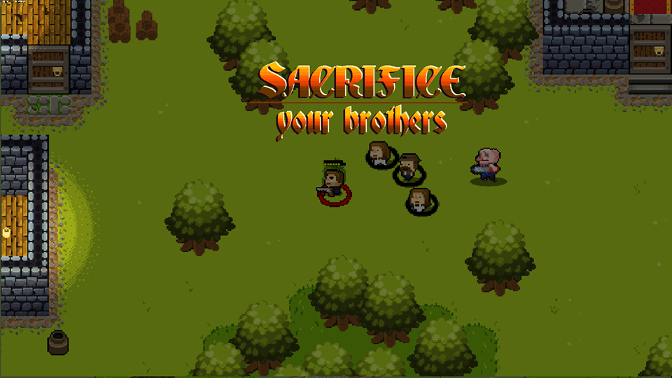
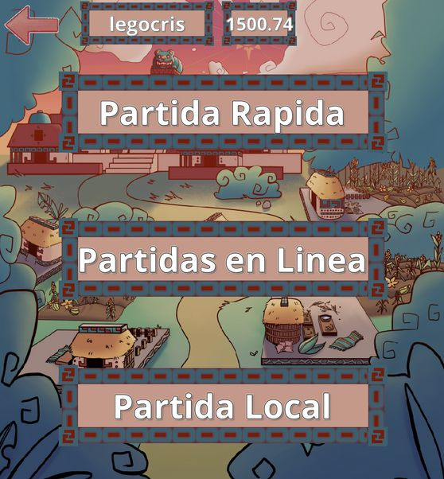
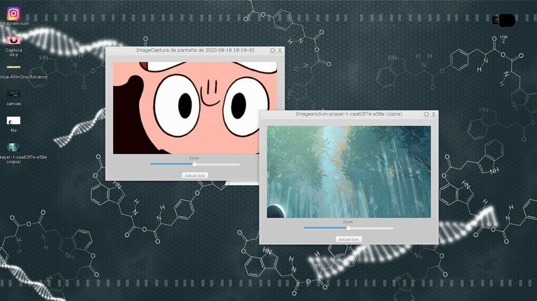
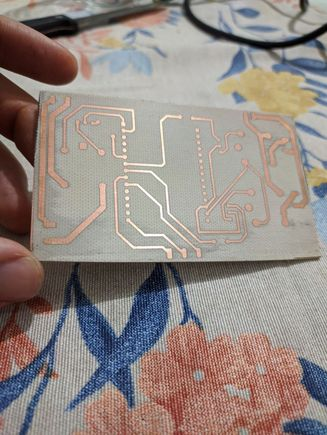
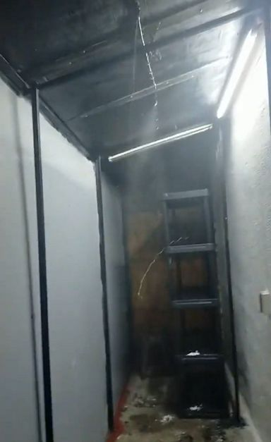

# Cristobal Cortés Gómez
### Programador y Matemático Inventor

📧 legocris@hotmail.com &nbsp;|&nbsp; [GitHub](https://github.com/legocris) &nbsp;|&nbsp; [LinkedIn](https://www.linkedin.com/in/cristobal-cortes-gomez)

Matemático con formación en álgebra abstracta y teoría de la computación, y desarrollador de videojuegos independiente. Este portafolio está dividido en 3 secciones:

# Games | Papers | Other

---

# 🎮 Games

### Sacrifice your Brothers — *2018*
Juego arcade multijugador local en el que tienes que decidir salvar a tus compañeros o sacrificarlos en una urna para ganar más tiempo de vida.

Link: [axolotlbros.itch.io/sacrifice-your-brothers](https://axolotlbros.itch.io/sacrifice-your-brothers)

---

### Camino a Xibalbá: PITZ — *2024-2025*
Diseñador y único programador del videojuego del juego de mesa Pitz.

Cliente: Jalapeño Labs &nbsp;|&nbsp; Tecnologías: GameMaker:Studio, JavaScript, Firebase
Link: [jalapenolab.mx/pages/pitz](https://jalapenolab.mx/pages/pitz)

---

### Open-Sourcerer — *2025-2026*
Videojuego 2D de acción para aprender a programar: los poderes del personaje se programan con JavaScript.

Cliente: Gnarled Helix LLC &nbsp;|&nbsp; Link: [open-sourcerer.com](https://open-sourcerer.com/)

---

### Me Canso Ganso — *2019*
Videojuego arcade en el que manejas al Presidente López Obrador cabalgando un ganso y saltas obstáculos cada vez más rápidos.

Tecnologías: GameMaker:Studio 2, GML
Links: [APK (APKPure)](https://apkpure.com/de/me-canso-ganso/com.piratagamesparatu.mecansoganso/download/1.0.0) &nbsp;|&nbsp; [Descarga alterna](https://drive.google.com/file/d/1a3S5-g950tGvitwL9Aq6CDquU3H9GVtZ/view?usp=sharing)

---

### Sweet Valentine's Day — *2014*
Juego arcade para móviles en el que eres cupido y debes conectar a la mayor cantidad de parejas.

Links: [APK (APKPure)](https://apkpure.com/sweet-valentine-s-day-free/com.axolotl.svdayfree) &nbsp;|&nbsp; [Descarga alterna](https://drive.google.com/file/d/1MA1SfxKcKKX8VI8fpP4RzvQA85vqMPDv/view?usp=sharing)

---

### Morbus — *2012*
Videojuego survival arcade: sobrevive a hordas de zombis mejorando tus armas. 🥉 Medalla de bronce en el concurso **Proyecto Multimedia 2012**.

Link: [Ejecutable](https://drive.google.com/file/d/1DNkXIkSf1YP37GFBk0NhI1SNT005FhZE/view?usp=sharing)

---

### Videojuego de escritorio corrupto — *2018 (Upwork)*
Simula el escritorio de una computadora: al abrir un archivo el sistema se corrompe y hay que memorizar y reescribir textos que aparecen por pocos segundos.

Cliente: Daniel Douglas

---

### Unity — Shader Conversion — *2018 (Upwork)*
Adaptación de un shader GLSL a HLSL para lograr una proyección esférica ("ojo de pescado") usada en una aplicación médica de realidad virtual.

Tecnologías: GLSL, HLSL, Unity3D &nbsp;|&nbsp; Cliente: Immertec, Jon Clagg

---

## Jam Games
Juegos de Global Game Jam en 48 hrs (desde 2012):

### Home Steal Rhythm Home
Rhythm Game hecho por el equipo Axolotl Brothers para la GGJ 2019.

**Otros juegos de Game Jams:**
- [Highlight reel (YouTube)](https://www.youtube.com/watch?v=sKryIP7iI3w)
- [Sweet Valentine's Day — GGJ 2013](http://2013.globalgamejam.org/2013/sweet-valentines-day)
- [Devil's Best Friend — GGJ 2016](http://globalgamejam.org/2016/games/devils-best-friend)
- [Chromobot Fighters: Roboffice Edition — GGJ 2018](https://v3.globalgamejam.org/2018/games/chromobot-fighters-roboffice-edition)
- [La Casa del Roboritmo — GGJ 2019](https://v3.globalgamejam.org/2019/games/la-casa-del-roboritmo)
- [Pit's Fire 4 — GGJ 2020](https://v3.globalgamejam.org/2020/games/pits-fire-4)
- [Comrade Spatial Baby 9 — GGJ 2024](https://globalgamejam.org/games/2024/comrade-spatial-baby-9)

---

## Axolotl Brothers
Proyecto independiente de desarrollo de videojuegos.

[YouTube](https://www.youtube.com/@axolotlbrothers1253) &nbsp;|&nbsp; [itch.io](https://axolotlbros.itch.io/) &nbsp;|&nbsp; [Facebook](https://www.facebook.com/AxolotlBros/) &nbsp;|&nbsp; [X / Twitter](https://x.com/axolotlbros?lang=ar-x-fm)

---

# 📄 Papers

### Análisis de conveniencia de Redes Neuronales angostas contra profundas
Proyecto final de la Licenciatura en Matemáticas (Universidad de Guadalajara, CUCEI). Análisis comparativo usando el perceptrón para problemas de clasificación.

Links: [Documento](https://drive.google.com/file/d/1y_D-IL4z9spmbDCHWOvdoEBr8vfhC2Ic/view?usp=sharing) &nbsp;|&nbsp; [Repositorio](https://github.com/legocris/Archivos-Proyecto-Analisis-de-Convergencia-RN)

---

# 🔧 Other

### Invernadero automático — *2023-2025*
Invernadero automático para cultivo de hongos comestibles, con control de humedad y temperatura, e instalación eléctrica completa.

Tecnologías: ESP8266, Arduino IoT, diseño de PCB
Video: [Ver en Drive](https://drive.google.com/file/d/1VXNXsHJxxcXPUsZ7u1oSj_WJdibgUq9U/view?usp=drive_link)

---

### Clases de robótica para niños — *2022*
Un semestre de clases de robótica para niños.

Cliente: American World Languages (AWL Chapultepec)
Video: [Ver en Drive](https://drive.google.com/file/d/1jcYXvor1MOY12M_HYyBxCDk3AN8kvsEa/view?usp=sharing)

---

### Proyecto INTERSEX — *2020-2022*
Trabajo de experimentación artística sobre la intersexualidad: cubrebocas LED personalizable y simulador de museo en 3D.

Tecnologías: JavaScript, Arduino, ESP8266, Blender, Unity3D
Link: [intersex.mx](https://intersex.mx/)

---

### Función de teatro Habitar — *2017*
Desarrollo de una aplicación con Kinect para modificar en tiempo real una proyección según los movimientos en escena.

Tecnologías: Processing, Java, GLSL &nbsp;|&nbsp; Dirección: Velvet Ramírez, área de Multimedia con Selene González y Eduardo Jiménez
Link: [Detalle en ITESO Cultura](https://cultura.iteso.mx/web/general/detalle?group_id=5313293)

---

### SGT Total — *2017-2020*
Página web para venta de luminarias de alumbrado público, adaptada a móviles (HTML + CSS).

Link: [sgt-total.com](https://sgt-total.com/)

---

### Automatización industrial — *2016-2017*
Diseño y creación de una máquina etiquetadora de botellas semiautomática, y programación de un PLC para una lava-llenadora de barriles.

Tecnologías: Arduino Mega, PLC Siemens (programación en diagrama de flujo) &nbsp;|&nbsp; Cliente: Cervejal
Video: [Ver en OneDrive](https://1drv.ms/v/s!Aslbn4nR5WV3gXMu1zZDiq8jeHbF)

---

### Entrevista — GAME DEV XPerience 2018, UNAM

---

### Cursos y actualizaciones académicas
- **Escuela de Matemáticas de Occidente (EMO 2024)** — 40 hrs. [Ver publicación](https://www.facebook.com/share/p/194nTvHzMR/)
- **PredGenIA (2023)** — Métodos de Aprendizaje Profundo para Predicción Genómica, 20 hrs. [Ver registro](https://silo.uy/vufind/Record/REDI_9e7d18e2dc02c81f054dbc56c7acd0d1/Details?sid=7802947)
- **VI Escuela de Verano en Matemáticas CUCEI (2022 y 2023)** — Formación intensiva, 60 hrs. [Ver](https://www.cucei.udg.mx/carreras/matematicas/es/video/escuela-de-verano-en-matematicas)
