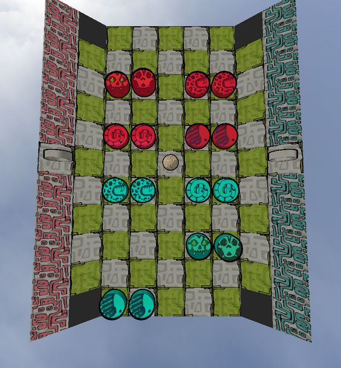
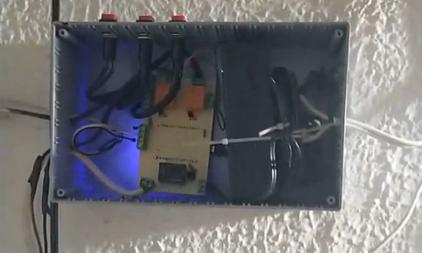
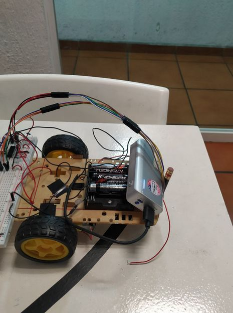
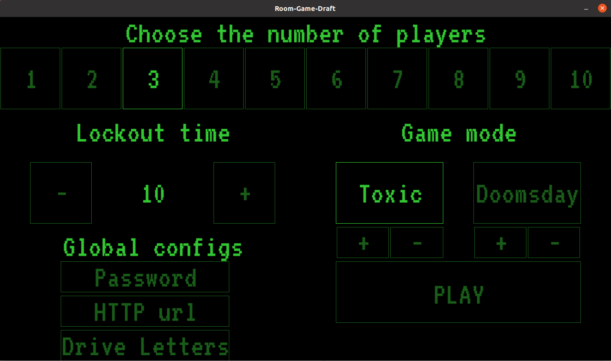
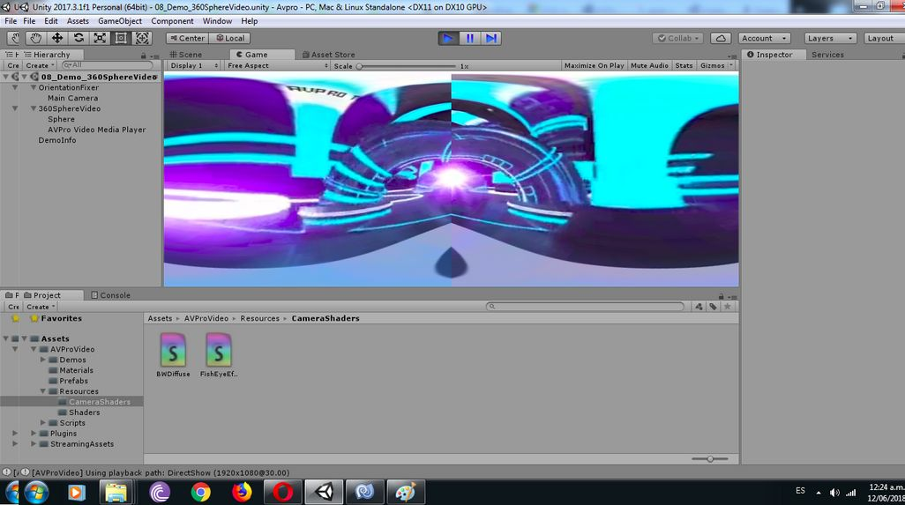

[Inicio](/Inicio.html) · [Juegos](/Juegos.html) · [Publicaciones](/Publicaciones.html) · **Trabajos** · [Otros](/Otros.html) | [EN](/JOBS.html)

# Trabajos

## [Gnarled Helix](https://open-sourcerer.com/)

## [Jalapeño Labs](https://jalapenolab.mx/pages/pitz)

## [Proyecto INTERSEX](https://intersex.mx/)

## [Automatización industrial — Cervejal](https://1drv.ms/v/s!Aslbn4nR5WV3gXMu1zZDiq8jeHbF)

# Freelance

## [Invernadero automático](https://drive.google.com/file/d/1VXNXsHJxxcXPUsZ7u1oSj_WJdibgUq9U/view?usp=drive_link)

Control automático de humedad y temperatura para cultivar hongos comestibles. *(2023-2025)*

## [Clases de robótica — American World Languages](https://drive.google.com/file/d/1jcYXvor1MOY12M_HYyBxCDk3AN8kvsEa/view?usp=sharing)

Un semestre de clases de robótica para niños. *(2022)*

## [SGT Total](https://sgt-total.com/)

Página web responsiva para venta de luminarias de alumbrado público. *(2017-2020)*

## Videojuego de escritorio corrupto

Simulas un escritorio que se corrompe: memoriza y reescribe los textos antes de perderlos. *(2018, Upwork, cliente Daniel Douglas)*

## Immertec — Conversión de shader en Unity

Conversión de un shader GLSL a HLSL para un visor VR médico. *(2018, Upwork, cliente Immertec)*

## [Teatro Habitar](https://cultura.iteso.mx/web/general/detalle?group_id=5313293)

Proyección interactiva con Kinect para una obra de teatro experimental. *(2017, dirigida por Velvet Ramírez)*
